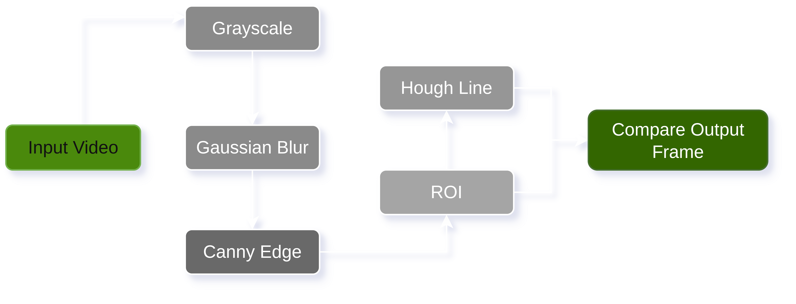
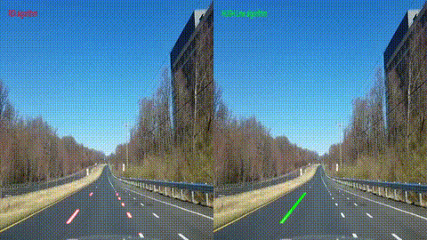

# 🚗 Lane Detection System

A beginner-friendly Computer Vision project that detects lane edges from a road video using classical image processing techniques.

This project currently implements image preprocessing, edge detection, Region of Interest (ROI), and Hough Line Transform.

---

# Problem Statement

Detect road lane markings from a driving video using traditional Computer Vision techniques. The goal is to extract lane edges while ignoring irrelevant parts of the image such as the sky, buildings, and surrounding environment.

---

# Features

- Read video frame-by-frame
- Convert frames to grayscale
- Reduce noise using Gaussian Blur
- Detect edges using Canny Edge Detection
- Apply Region of Interest (ROI) masking
- Detect straight lines using Hough Line Transform
- Display detected lane lines on the original frame

---

# Architecture Diagram

<div align="center" style="margin-top:60px; margin-bottom:40px" >
  
</div>

---

# Data

Place a road driving video inside the `data/` directory.

```
data/
└── road.mp4
```

The project is tested using a forward-facing driving video.

---

# Installation

Clone the repository:

```bash
git clone https://github.com/your-username/lane-detection-system.git
cd lane-detection-system
```

Install uv:

```bash
curl -LsSf https://astral.sh/uv/install.sh | sh
```
or
```bash
wget -qO- https://astral.sh/uv/install.sh | sh
```
or
```bash
curl -LsSf https://astral.sh/uv/0.11.32/install.sh | sh
```

Install dependencies:

```bash
uv add opencv-python numpy cvzone
```
---

# Usage

Run the project:

```bash
uv run src/main.py
```

Press **Q** to exit the video window.

---

# Results

The output displays:

- Detected lane edges
- Hough line detection
- Lane lines overlaid on the original video

---

# Demo

### Input

🎥 **[Watch the input video](data/road.mp4)**


### Output
🎥 **[Watch the output video](output/output.mp4)**



---

# Future Improvements

- Average left and right lane lines
- Lane tracking across frames
- Curved lane detection
- Perspective (Bird's Eye) Transform
- Lane departure warning
- Real-time performance optimization

---

# License

This project is licensed under the **MIT License**.
